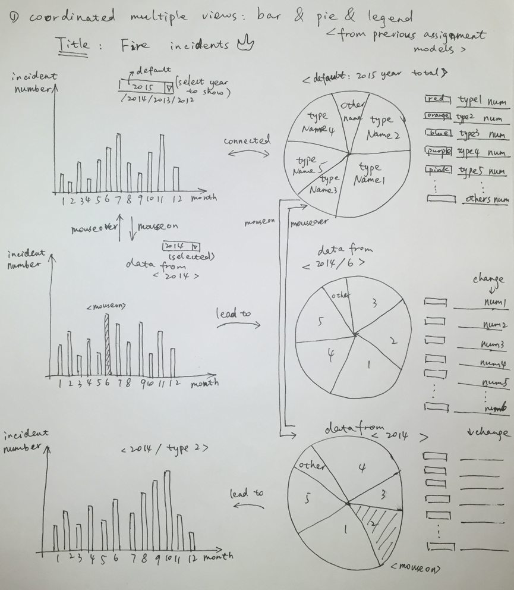
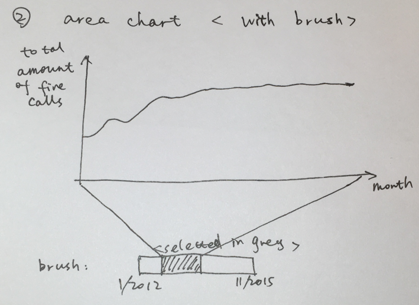
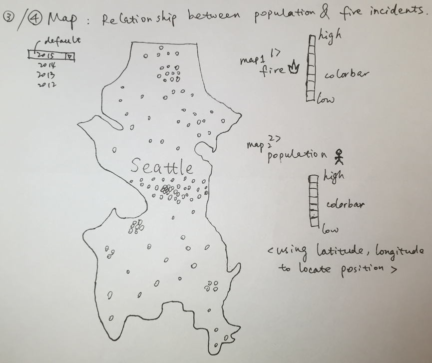

Final Project - Interactive Data Visualization - Proposal
===

Basic Information
---
- Project title: Seattle Fire Emergency Analysis
- Team members: Qianyun Yang, qyang@wpi.edu, xiaoyouyang;
                Qiuzhe Ma, qma2@wpi.edu, qiuzhema

Background and Motivation 
---
Our final project is about fire emergency happened in Seattle from 2012 to 2015. The existence of fire changes our life and behavior. We need fire to cook, to keep warm and fire is also necessary in manufacture. But if people are not cautious about fire, it may lead to disasters. Each year people die or are seriously injured as a result of fires at work. Besides loss of life, fire costs people millions of money from damage of property, loss of business, fire compensation and insurance premiums. Many of these fires can be avoided by taking fire precautions. If a fire breaks out a lot of the effects can be minimized by having effective controls and procedures in place. This project therefore intends to make an assessment of the factors influencing fire disaster preparedness. We consider that our analysis may provide valuable information to improve allocation of fire resources, and remind people about the fire prevention in effective ways. 

Project Objectives
---
The world has in the past decades experienced succession of fire disasters. These disasters have claimed many thousands of life, caused material looses and afflicted terrible toll. Thus, people need to be well equipped in terms of knowledge on how to prevent and react to fire outbreaks. We try to analyze the fire emergency in Seattle and get some conclusions of which reason may cause fire emergency most, which time period may fire happens frequently, what locations may fire happens the most. We intend to use visualizations such as bar chart, pie chart, area chart and Seattle map together to design coordinated multiple views. Our design will make the fire data intuitionistic interface to users and is interesting to understand and learn.

Data
---
The first data we collected is named Seattle Real Time Fire 911 calls. We find a website that describe Seattle real time fire 911 calls from 2010 to now. The data will update every minute and we choose the dataset from 1/1/2010 to 11/17/2015. The dataset includes information such as address, type, date time, latitude, longitude, report location and incident number. The second data we find is Seattle population because we also want to find the relationship between density of fire incidents and density of population of Seattle. The population density in Seattle includes population density and location information in 2015. The third data we find is the map of Seattle in json file. Here are the links to the website where we find our data:
Fire Calls Link: https://data.seattle.gov/Public-Safety/Seattle-Real-Time-Fire-911-Calls/kzjm-xkqj
Seattle Map Link: https://catalog.data.gov/dataset/seattle-json
Seattle Population Link: http://www.arcgis.com/home/webmap/viewer.html?webmap=cdf24bce6363445e83670a6ea42f5dbe

Data Processing
---
- We need time, type and location (longitude, latitude) information, but we do not need street location in our design. That is because longitude and latitude can be called directly in coding, and street location tells the same description in words. 
- We also do not need the column named incident number. This is like the order number and we try to replace it by ordered integers.
- We remove the data from 1/1/2010 to 12/31/2011, which we figure out that the quality of the data is low because there is always a data missing, and the quantity is not large compared to other years’ data.
- After data clean up, we have more than 300 thousands of columns of data to process, which is an enormous dataset and is enough for our analysis.
- We want to design a map that shows the relationship between population density and fire incidents density.
- We decide to make the data in json file to be called in our code.

Visualization Design
---
- Design 1: Coordinated multiple views: bar chart, pie chart and legend.

- Design 2: Area chart with brush shows time varying specific type.

- Design 3: Heat Maps 1) Population density  2)Fire incident density

Must-Have Features
---
- Map of Seattle, with location info marked on it to show the relation between location and fire happening frequency.
- Coordinated multiple view: bar chart, pie chart and legend. Bar chart showing amount of fire happening monthly from 2012 to 2015. Pie chart showing type of fire frequency to get what kind of factors in daily life will cause fire mostly. Legend changes with pie chart to show data in detail.
- Area chart by choosing different types to analyze weather the frequency of fire decrease with technology development.

Optional Features
---
- Map of Seattle, with location info marked on it to show the relation between location and population density.

Project Schedule
---
Below is a schedule of what we plan to do by the end of each week:
- Week 1: Create the basis of a prototype
- Week 2: Finish the prototype, start to build individual visualizations
- Week 3: Combine visualizations and make them interactive
- Week 4: Write report, fix bugs and prepare for presentation.

References
---
http://dataviscourse.net/2015/project/
